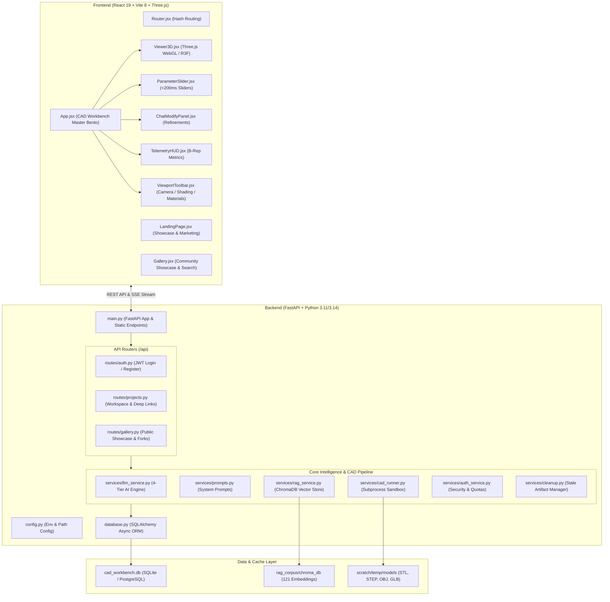

# AI Parametric CAD Workbench — Comprehensive Architecture & Codebase Guide

> **A Complete Engineering Manual Explaining How the Application Works and the Exact Role of Every File in the Repository.**

---

## Table of Contents

1. [System Overview & Core Philosophy](#1-system-overview--core-philosophy)
2. [End-to-End Operational Workflow](#2-end-to-end-operational-workflow)
   - [2.1 Prompt-to-CAD Generation Flow](#21-prompt-to-cad-generation-flow)
   - [2.2 Real-Time Slider Recomputation Flow (<200ms)](#22-real-time-slider-recomputation-flow-200ms)
   - [2.3 Chat-to-Modify Engineering Revision Loop](#23-chat-to-modify-engineering-revision-loop)
   - [2.4 On-Demand Gallery & Deep-Link Resolution](#24-on-demand-gallery--deep-link-resolution)
3. [System Architecture Diagram](#3-system-architecture-diagram)
4. [File-by-File Breakdown & Module Roles](#4-file-by-file-breakdown--module-roles)
   - [4.1 Repository Root Files](#41-repository-root-files)
   - [4.2 Backend Root & Configuration](#42-backend-root--configuration)
   - [4.3 Backend API Routes (`backend/routes/`)](#43-backend-api-routes-backendroutes)
   - [4.4 Backend Services & Engines (`backend/services/`)](#44-backend-services--engines-backendservices)
   - [4.5 Backend Database Models (`backend/models/`)](#45-backend-database-models-backendmodels)
   - [4.6 Backend Middleware (`backend/middleware/`)](#46-backend-middleware-backendmiddleware)
   - [4.7 RAG Corpus & CAD Knowledge Base (`backend/rag_corpus/`)](#47-rag-corpus--cad-knowledge-base-backendrag_corpus)
   - [4.8 Backend Developer Tools (`backend/tools/`)](#48-backend-developer-tools-backendtools)
   - [4.9 Backend Automated Test Suite (`backend/test_*.py`)](#49-backend-automated-test-suite-backendtest_py)
   - [4.10 Frontend Application Core (`frontend/src/`)](#410-frontend-application-core-frontendsrc)
   - [4.11 Frontend Pages (`frontend/src/pages/`)](#411-frontend-pages-frontendsrcpages)
   - [4.12 Frontend UI Components (`frontend/src/components/`)](#412-frontend-ui-components-frontendsrccomponents)
   - [4.13 Frontend Custom React Hooks (`frontend/src/hooks/`)](#413-frontend-custom-react-hooks-frontendsrchooks)
   - [4.14 Frontend Constants & Utilities (`frontend/src/constants/`, `frontend/src/utils/`)](#414-frontend-constants--utilities-frontendsrcconstants-frontendsrcutils)
5. [Security Sandboxing & Production Hardening](#5-security-sandboxing--production-hardening)
6. [Summary Cheat-Sheet](#6-summary-cheat-sheet)

---

## 1. System Overview & Core Philosophy

The **AI Parametric CAD Workbench** is a professional-grade full-stack computer-aided design platform that turns natural language engineering requirements into **true boundary-representation (B-Rep) solid 3D models** directly in the browser.

### Why Python Code and Not Direct 3D Meshes?
Traditional generative 3D approaches (like NeRFs, Gaussian splatting, or point-cloud diffusion) produce "dumb", uneditable polygonal meshes. They cannot be manufactured, lack dimensional accuracy, have no parametric history, and cannot be exported to CNC machines or industrial CAD software like SolidWorks or Fusion 360.

**Our Core Philosophy:**
1. **Code is the Universal CAD Representation:** The LLM does **not** output vertices. Instead, it generates strict, deterministic Python scripts using the `build123d` solid modeling framework (backed by the industrial C++ OpenCASCADE Open CASCADE Technology geometry kernel).
2. **Parametric First:** Every design generated contains an explicit `PARAMS = { ... }` block. Each dimension, hole radius, fillet size, and wall thickness is declared with physical units and bounds.
3. **Sub-200ms Direct Recomputation:** When a user moves a slider in the UI, **the LLM is never invoked**. The backend simply injects the new dictionary into the Python script and re-executes the OpenCASCADE kernel in under 200ms.
4. **Self-Correcting Compiler Loop:** If an LLM generates syntax errors or topologically invalid geometry (e.g., self-intersecting lofts or disconnected solids), the system captures the exact Python compiler traceback, feeds it back to the LLM with an engineering repair prompt, and automatically repairs the model before returning it to the user.

---

## 2. End-to-End Operational Workflow

### 2.1 Prompt-to-CAD Generation Flow

```
[User Natural Language Prompt]
             │
             ▼
[1. PII Redaction & Rate Limiting]
   • Scrubs emails, phone numbers, and keys
   • Enforces IP/User sliding window rate limits (10/min) and daily quotas (50/day)
             │
             ▼
[2. RAG Retrieval via ChromaDB]
   • sentence-transformers converts prompt into a 384-dim semantic embedding
   • ChromaDB finds top-3 closest validated CAD archetypes from 121 engineering templates
             │
             ▼
[3. LLM Synthesis & 4-Tier Fallback]
   • Tier 1: Gemini 2.5 Flash Lite API (Fastest, primary)
   • Tier 2: Gemini Flash Lite Latest API (Fallback)
   • Tier 3: Gemini Web Reverse-Engineered Session (Zero-auth / browser cookie proxy)
   • Tier 4: Groq Cloud (Llama-3.3-70B-Versatile)
             │
             ▼
[4. Dual-Output Extraction]
   • System prompt forces model to generate both:
     a) Python build123d CAD script with PARAMS dict
     b) JSON UI parameter specification (min, max, step, default, unit)
             │
             ▼
[5. AST Security Sandbox Analysis]
   • Parses Python Abstract Syntax Tree (AST) before execution
   • Blocks dunders (`__subclasses__`), dangerous builtins (`eval`, `exec`, `open`),
     system imports (`os`, `sys`, `subprocess`, `socket`), and unauthorized aliases
             │
             ▼
[6. Isolated Subprocess Kernel Execution]
   • Runs Python in an isolated worker process with stripped environment variables
   • Compiles B-Rep geometry in OpenCASCADE
   • Exports Watertight STL (WebGL viewer) and STEP (production manufacturing CAD)
   • Self-Correction: If execution fails, captures traceback and retries up to 3 times
             │
             ▼
[7. Trimesh Geometry Health & Manifold Verification]
   • Inspects volume, surface area, bounding envelope, body count, watertight manifold
             │
             ▼
[8. Real-Time SSE Stream / JSON Response]
   • Frontend receives generation metadata, parameter list, and asset download URLs
```

### 2.2 Real-Time Slider Recomputation Flow (<200ms)
1. User drags a dimension slider in `ParameterSlider.jsx`.
2. Frontend debounces (120ms) and sends an HTTP POST to `/api/recompute` with `{ script_id, updated_parameters }`.
3. Backend takes the cached/persisted Python script, uses brace-matching parsing (`_find_params_block`) to cleanly swap the `PARAMS = { ... }` block with new values.
4. Executes the updated script via `CADRunner.execute_script_async()` directly in the OpenCASCADE kernel.
5. Emits the newly generated binary STL mesh. The Three.js viewer updates in real time without any LLM delay.

### 2.3 Chat-to-Modify Engineering Revision Loop
1. User enters natural language modification (e.g., *"Add 4x M4 counterbore mounting holes on corners"*).
2. Frontend calls `/api/modify`.
3. Backend provides the LLM with:
   - The current working Python CAD script.
   - The user's delta modification instruction.
   - Strict guidelines on preserving existing parameter keys while adding new ones.
4. LLM outputs updated Python code + modified parameter schemas.
5. Code passes through AST security, executes in subprocess, and creates a new version record (`_v1`, `_v2`) attached to the design's history.

### 2.4 On-Demand Gallery & Deep-Link Resolution
1. When browsing `#gallery` or opening a shared deep-link `#model=<id>`, the browser calls `/api/generations/{id}`.
2. If physical mesh files (`.stl`, `.step`) were cleared by cleanup routines, **On-Demand Auto-Regeneration** kicks in: the server retrieves the validated Python script from the SQLite/PostgreSQL database, executes CAD compilation on the fly, and streams the 3D model with 0 downtime.

---

## 3. System Architecture Diagram



---

## 4. File-by-File Breakdown & Module Roles

### 4.1 Repository Root Files

| File | Exact Role & Responsibilities |
|---|---|
| `docker-compose.yml` | Multi-container Docker orchestration. Spins up the FastAPI backend and Nginx-served Vite frontend. Configured with volume mounts for persistent database and CAD model scratch space. |
| `Dockerfile` | Multi-stage production container build for the Python backend. Installs OpenCASCADE libraries, `build123d`, PyTorch, sentence-transformers, and sets up non-root security. |
| `README.md` | Primary developer onboarding documentation: quick-start commands, prerequisites, setup instructions, and feature overview. |
| `architecture.md` | Comprehensive architectural blueprint: pipeline details, 4-tier fallback matrix, OpenCASCADE data flow, and error taxonomy. |
| `prd.md` | Product Requirements Document: specifies target user personas, core features, engineering constraints, and product roadmap. |
| `design.md` | UI/UX Design System Specification: defines the Technical Neobrutalist Bento design system, typography (Inter + Outfit), color palette, and micro-interactions. |
| `rules.md` | Engineering guidelines and coding standards: strict constraints on build123d API usage, forbidden CAD patterns, and AST sandbox rules. |
| `task.md` | Active sprint tracking board: backlog items, completed features, and implementation notes. |
| `memory.md` | Persistent architectural memory: records critical debugging solutions, architectural decisions, and key technical learnings. |
| `CHANGELOG.md` | Strict Keep-a-Changelog format documenting all additions, fixes, dependency upgrades, and security patches. |
| `dev.bat` | One-click Windows launch script. Automatically starts both backend uvicorn server and Vite frontend server in separate terminals. |
| `.gitignore` | Prevents environment keys (`.env`), Python caches, temporary CAD meshes (`.stl`, `.step`), databases, and `node_modules` from entering git. |
| `.github/workflows/ci.yml` | GitHub Actions CI/CD pipeline: runs 80 backend pytest regression tests and builds the Vite frontend production bundle on every push and PR. |

---

### 4.2 Backend Root & Configuration

| File | Exact Role & Responsibilities |
|---|---|
| `backend/main.py` | **Main application entrypoint**. Initializes the FastAPI app, manages application lifespan (creating database tables and checking RAG status), configures CORS, mounts routers, serves generated 3D assets (`/static/models/...`) with on-demand regeneration, and houses the primary `/api/generate` and `/api/generate/stream` endpoints. |
| `backend/config.py` | Centralized environment and configuration manager. Safely reads `.env` variables (ports, hosts, API keys, JWT secrets, database connection URLs, concurrency semaphores, and directory paths) with fallback defaults. |
| `backend/database.py` | SQLAlchemy async database layer. Configures the database engine (SQLite with WAL mode by default, PostgreSQL-compatible), session factories, and runs automatic startup schema migrations. |
| `backend/schemas.py` | Pydantic data schemas (v2). Defines strict request and response models for generation, recomputation, modification, telemetry, parameters, and version history. |
| `backend/startup_check.py` | Diagnostic script. Verifies that all required C++ CAD geometry libraries, AI clients, vector stores, and environment variables are present and functioning properly before booting. |
| `backend/seed_gallery.py` | Showcase database seeder. Compiles and populates the community gallery with 8 foundational mechanical CAD models (spur gear, pulley, pipe elbow, enclosure, etc.) ensuring real geometry exists on day one. |
| `backend/benchmark_eval.py` | Quality benchmarking tool. Evaluates prompt-to-CAD success rates across complex mechanical archetypes and outputs timing and manifold statistics to `benchmark_results.json`. |
| `backend/run_tests.py` | Test orchestrator. Runs the complete test suite (unit tests, integration tests, security sandboxes, and API endpoints) across all platforms. |
| `backend/run.bat` & `backend/run_tests.bat` | Quick Windows execution scripts to launch the backend server or run tests in the virtual environment. |
| `backend/pytest.ini` | Pytest configuration file. Configures asyncio mode, test discovery patterns, and filter warnings. |
| `backend/requirements.txt` | Complete Python package dependencies list: FastAPI, build123d, google-genai, groq, trimesh, chromadb, sentence-transformers, SQLAlchemy, bcrypt, PyJWT, and pytest. |
| `backend/.env.example` | Template environment variable file documenting all available configuration keys with descriptions. |

---

### 4.3 Backend API Routes (`backend/routes/`)

| File | Exact Role & Responsibilities |
|---|---|
| `backend/routes/__init__.py` | Package initializer for backend routes. |
| `backend/routes/auth.py` | **User Authentication Router** (`/api/auth`). Handles user registration, bcrypt password hashing, login, JWT token issuance, refresh token rotation, and current user profile fetching (`/api/auth/me`). |
| `backend/routes/projects.py` | **Workspace & Project Router** (`/api/projects`, `/api/generations`). Provides CRUD endpoints for user project folders, generation history, version history, and deep-link model detail retrieval with automatic geometry regeneration. |
| `backend/routes/gallery.py` | **Community Showcase Router** (`/api/gallery`, `/api/designs`). Supports searching, tag filtering, sorting by popularity or recent, liking designs with atomic counters, publishing designs, and forking models into user workspaces. |

---

### 4.4 Backend Services & Engines (`backend/services/`)

| File | Exact Role & Responsibilities |
|---|---|
| `backend/services/__init__.py` | Package initializer for backend services. |
| `backend/services/cad_runner.py` | **OpenCASCADE Execution Engine & Sandbox**. Wraps `build123d` scripts, applies AST safety checks, executes scripts in isolated worker threads/subprocesses, validates post-execution geometry (watertightness, volume, body count), and exports STL, STEP, OBJ, and GLB files. |
| `backend/services/llm_service.py` | **4-Tier LLM Multi-Model Fallback Engine**. Coordinates prompt delivery across Gemini API, Gemini Web Client, and Groq Cloud. Manages the automated self-correction loop when compiler errors occur. |
| `backend/services/prompts.py` | **CAD Engineering Prompt Library**. Contains detailed system prompts, few-shot examples, and strict syntax rules instructing LLMs on how to write valid, collision-free `build123d` code. |
| `backend/services/rag_service.py` | **RAG Knowledge Base & Vector Index**. Uses `sentence-transformers/all-MiniLM-L6-v2` and `ChromaDB` to index and retrieve validated CAD code templates based on semantic similarity to the user's prompt. |
| `backend/services/auth_service.py` | **Security, JWT, & Quota Enforcement**. Handles JWT token generation/decoding, password hashing, user quota tracking (free-tier 50 calls/day), and per-user rate limit key generation. |
| `backend/services/cleanup.py` | **Artifact Lifecycle Manager**. Periodically purges stale temporary files and meshes older than 24 hours while explicitly preserving permanent showcase seed models. |
| `backend/services/gemini_web_client.py` | **Reverse-Engineered Gemini Web2API Client**. Allows the workbench to communicate directly with Gemini Web interface endpoints for zero-auth or session-cookie-backed inference when official API quotas are exceeded. |

---

### 4.5 Backend Database Models (`backend/models/`)

| File | Exact Role & Responsibilities |
|---|---|
| `backend/models/__init__.py` | Package initializer importing User, Project, Generation, and Version models. |
| `backend/models/user.py` | **User Database Entity**. Defines user accounts, email, hashed passwords, display names, subscription tiers (`free`, `pro`, `studio`), and daily usage quota counters. |
| `backend/models/project.py` | **Project & Generation Entities**. Defines `Project` (workspace folder), `Generation` (a synthesized 3D model, its prompt, code, parameters, mesh URLs, likes, and fork counts), and `Version` (revision history for chat modifications). |

---

### 4.6 Backend Middleware (`backend/middleware/`)

| File | Exact Role & Responsibilities |
|---|---|
| `backend/middleware/__init__.py` | Package initializer for middleware. |
| `backend/middleware/telemetry.py` | **Observability & Metrics Middleware**. Records HTTP request counts, error rates, p50/p95 response latencies, and generation success rates, exposed via `/api/metrics`. |

---

### 4.7 RAG Corpus & CAD Knowledge Base (`backend/rag_corpus/`)

| File | Exact Role & Responsibilities |
|---|---|
| `backend/rag_corpus/__init__.py` | Aggregates all example datasets into a single unified training and retrieval list. |
| `backend/rag_corpus/examples_universal.py` | **20 Foundational Universal Archetypes**. Contains verified, robust parametric code for shafts, gears, flanges, enclosures, pulleys, ducts, and brackets. |
| `backend/rag_corpus/examples_complex.py` | Advanced mechanical designs: complex assemblies, multi-part mechanisms, and lofted fluid passages. |
| `backend/rag_corpus/examples_engineering.py` | Standard industrial machine components: bearings, keyways, bolted flanges, and motor brackets. |
| `backend/rag_corpus/examples_week4.py` | Core geometric primitives and initial build123d test scripts. |
| `backend/rag_corpus/examples_week5.py` | Swept profiles, rotational features, and thin-walled enclosure examples. |
| `backend/rag_corpus/examples_week8.py` | Advanced assemblies, multi-body Booleans, and parametric filleting examples. |

---

### 4.8 Backend Developer Tools (`backend/tools/`)

| File | Exact Role & Responsibilities |
|---|---|
| `backend/tools/rebuild_rag.py` | CLI utility to force-rebuild the ChromaDB vector database index from current source files. |
| `backend/tools/run_gemini_web2api.py` | Standalone local proxy runner for the Gemini Web reverse client. |
| `backend/tools/test_rag_retrieval.py` | Quick verification script to test vector retrieval accuracy for specific search queries. |

---

### 4.9 Backend Automated Test Suite (`backend/test_*.py`)

| File | Exact Role & Responsibilities |
|---|---|
| `backend/test_api.py` | FastAPI endpoint integration tests: verifies `/health`, `/generate`, `/recompute`, `/modify`, and CORS headers. |
| `backend/test_ast_security.py` | Security tests: subjects the AST parser to 15+ adversarial scripts (eval, imports, dunders, system access) to verify isolation. |
| `backend/test_auth_projects.py` | Authentication & ownership tests: verifies registration, login, token refresh, and private model permission checks. |
| `backend/test_gallery_and_formats.py` | Gallery tests: verifies sorting, filtering, liking, and multi-format exports (STL, STEP, OBJ, GLB). |
| `backend/test_gemini_web_client.py` | Unit tests verifying the reverse-engineered web client headers and response parser. |
| `backend/test_geometry_validation.py` | Geometry validator tests: verifies manifold edge checks, watertight assertions, and volume calculation. |
| `backend/test_llm_parser.py` | Tests regex and JSON parsing of dual-output LLM payloads. |
| `backend/test_modify_params.py` | Verifies parameter preservation and delta changes during "Chat-to-Modify" operations. |
| `backend/test_pii_scrub.py` | Verifies redaction of sensitive personal information (emails, phone numbers, API keys) from user prompts. |
| `backend/test_pipeline.py` | Full asynchronous subprocess execution test: runs real OpenCASCADE compilation and error trapping. |
| `backend/test_quota.py` | Verifies free-tier daily quotas (50 generations/day) and daily reset logic. |
| `backend/test_recompute_validation.py` | Tests sub-200ms parameter injection without syntax distortion. |
| `backend/test_schemas.py` | Validates Pydantic schema constraints, types, and defaults. |
| `backend/test_universal_archetypes.py` | Verifies that all 20 universal archetype scripts compile into single-solid, watertight B-Rep models. |

---

### 4.10 Frontend Application Core (`frontend/src/`)

| File | Exact Role & Responsibilities |
|---|---|
| `frontend/package.json` | Node.js project manifest. Defines dependencies: React 19, `@react-three/fiber`, `@react-three/drei`, Three.js, Axios, and Vite. |
| `frontend/vite.config.js` | Vite bundler configuration. Configures React plugin, proxy forwards (`/api` and `/static` to port 8000), and code-splits Three.js into a separate vendor chunk. |
| `frontend/index.html` | Application HTML entrypoint. Loads Google Fonts (Inter, Outfit) and sets up SEO metadata. |
| `frontend/src/main.jsx` | React DOM root mounting script. Mounts `Router.jsx` inside React StrictMode. |
| `frontend/src/Router.jsx` | **Hash-Based Router**. Listens to `window.location.hash` and smoothly switches between `LandingPage`, `Gallery`, and `App` (Workbench). |
| `frontend/src/App.jsx` | **Master CAD Workbench UI**. The central interface coordinating the Bento Grid layout, 3D viewport, parameter sliders, chat panel, telemetry HUD, toolbar, and project drawers. |
| `frontend/src/LandingPage.jsx` | **Marketing & Product Homepage**. High-converting landing page with technical aesthetic, interactive feature showcases, preset CAD prompt launchpads, and live preview links. |
| `frontend/src/api.js` | **Axios API Client**. Centralizes all HTTP calls (auth, generation, streaming SSE, recompute, modify, gallery, likes, and batch ZIP downloads). |
| `frontend/src/index.css` | **Global Design System CSS**. Neobrutalist design system styling, custom scrollbars, Bento grid layouts, high-contrast borders, and color tokens. |

---

### 4.11 Frontend Pages (`frontend/src/pages/`)

| File | Exact Role & Responsibilities |
|---|---|
| `frontend/src/pages/Gallery.jsx` | **Community Showcase Page**. Displays searchable, filterable grid of public CAD designs with live vector blueprint previews, likes, tags, and one-click opening/forking into the 3D Workbench. |

---

### 4.12 Frontend UI Components (`frontend/src/components/`)

| File | Exact Role & Responsibilities |
|---|---|
| `frontend/src/components/Viewer3D.jsx` | **Interactive 3D WebGL Viewport**. Powered by `@react-three/fiber` and Three.js. Renders STL meshes, shaded wireframe edges, dimensional bounding boxes, coordinate axes, and lighting. |
| `frontend/src/components/ParameterSlider.jsx` | **Parametric Slider Controller**. Displays numeric inputs and range sliders for part dimensions. Debounces updates and triggers sub-200ms kernel recomputations. |
| `frontend/src/components/ChatModifyPanel.jsx` | **Conversational Modification Interface**. Chat interface allowing users to refine their model in natural language, with quick engineering modification presets. |
| `frontend/src/components/PromptPanel.jsx` | **Natural Language Prompt Input**. Primary text entry panel with generate trigger, generation status badges, and quick-start prompt categories. |
| `frontend/src/components/TelemetryHUD.jsx` | **Engineering Telemetry Overlay**. Floating viewport HUD displaying physical metrics: watertightness status, body count, volume ($mm^3$), and bounding envelope dimensions. |
| `frontend/src/components/ViewportToolbar.jsx` | **Viewport Control Bar**. Floating toolbar providing camera preset toggles (Top, Front, Side, Isometric), PBR material selection, and visual style modes (shaded edges, wireframe). |
| `frontend/src/components/ModelThumbnail.jsx` | **Vector Blueprint Thumbnail Generator**. Renders interactive CAD archetype diagrams with technical grid overlays, measurement indicators, and material badges. |
| `frontend/src/components/OnboardingTour.jsx` | **Interactive User Guided Tour**. 6-step walkthrough introducing new users to prompt synthesis, 3D controls, sliders, conversational revisions, and CNC exports. |
| `frontend/src/components/ProjectSidebar.jsx` | **Workspace Drawer**. Collapsible sidebar showing user project folders, saved generations, and version history. |
| `frontend/src/components/ShareModal.jsx` | **Sharing & Embed Modal**. Generates direct deep links (`#model=<id>`) and embeddable iframe code snippets. |
| `frontend/src/components/AuthModal.jsx` | **Authentication Modal**. Handles user login and account registration with validation and error surfacing. |
| `frontend/src/components/CodeInspectorModal.jsx` | **Python Code Inspector**. Modal allowing engineers to view, inspect, and copy the raw `build123d` Python script generated by the AI. |
| `frontend/src/components/GenerationProgress.jsx` | **Multi-Stage Progress Indicator**. Visual indicator showing real-time SSE progress through the 4 stages: RAG retrieval, LLM synthesis, kernel compilation, and mesh export. |
| `frontend/src/components/ErrorBanner.jsx` | **Error Notification Banner**. Inline alert banner for network, syntax, or server error notifications. |

---

### 4.13 Frontend Custom React Hooks (`frontend/src/hooks/`)

| File | Exact Role & Responsibilities |
|---|---|
| `frontend/src/hooks/useAuth.js` | Manages authentication state, token persistence in localStorage, user profiles, login, and logout. |
| `frontend/src/hooks/useCADWorkbench.js` | **Central State Machine**. Manages the full CAD workbench state using `useReducer`: active model, parameters, history, camera view, theme, and stream progress. |
| `frontend/src/hooks/useFocusTrap.js` | Accessibility hook. Traps keyboard focus within active modals and handles Escape-to-close behavior. |

---

### 4.14 Frontend Constants & Utilities (`frontend/src/constants/`, `frontend/src/utils/`)

| File | Exact Role & Responsibilities |
|---|---|
| `frontend/src/constants/materials.js` | PBR material definitions: Machined Aluminum, Tooling Yellow, CAD Blue, Carbon Slate, and Foundry Copper. |
| `frontend/src/constants/visualStyles.js` | Viewport rendering configurations: background colors, grid setups, edge contrast, and lighting presets. |
| `frontend/src/utils/logger.js` | Lightweight logging utility that outputs debug messages in development and suppresses noise in production builds. |

---

## 5. Security Sandboxing & Production Hardening

Because the system allows an AI model to write and execute Python code, multiple independent security layers are enforced:

1. **Static AST Analysis ([cad_runner.py](file:///d:/Projects/Minor_project/backend/services/cad_runner.py)):**
   - The script is parsed into an Abstract Syntax Tree before execution.
   - Any reference to system builtins (`eval`, `exec`, `open`, `globals`, `locals`, `__import__`) immediately raises a Security Error.
   - Any import other than `build123d`, `math`, `typing`, or `scipy` is rejected.
   - Dunder attribute lookups (`__class__`, `__subclasses__`, `__bases__`) are strictly blocked.
2. **Subprocess Isolation:**
   - Scripts are executed in separate Python subprocesses using clean, stripped environment dictionaries (`PYTHONNOUSERSITE=1`, empty `PYTHONPATH`).
3. **Execution Semaphores & Timeouts:**
   - Subprocesses are guarded by concurrency semaphores (`CAD_MAX_CONCURRENT_EXECUTIONS = 2`) and hard execution timeouts (default 60s) to prevent resource starvation or infinite loops.
4. **Data Privacy (PII Scrubbing):**
   - User prompts pass through regex filters that scrub email addresses, phone numbers, and potential secrets before transmitting to external LLM providers.
5. **On-Demand Mesh Regeneration:**
   - Physical mesh files can be safely purged during cleanup cycles. If a user requests a model via deep-link or gallery, the server regenerates the geometry on the fly from the stored code.

---

## 6. Summary Cheat-Sheet

| Action / Requirement | Primary Responsible File |
|---|---|
| **Add a new CAD template to RAG** | `backend/rag_corpus/examples_universal.py` |
| **Change LLM fallback models or API keys** | `backend/config.py` & `backend/services/llm_service.py` |
| **Modify the 3D viewer lighting / materials** | `frontend/src/components/Viewer3D.jsx` & `frontend/src/constants/materials.js` |
| **Tweak the prompt given to the AI** | `backend/services/prompts.py` |
| **Adjust slider behavior or debounce** | `frontend/src/components/ParameterSlider.jsx` |
| **Run the complete automated test suite** | `backend/run_tests.py` or `pytest` |
| **Build frontend for production deployment** | `npm run build` in `frontend/` |
| **Start full stack locally with one command** | `dev.bat` (Windows) or `docker-compose up` |
